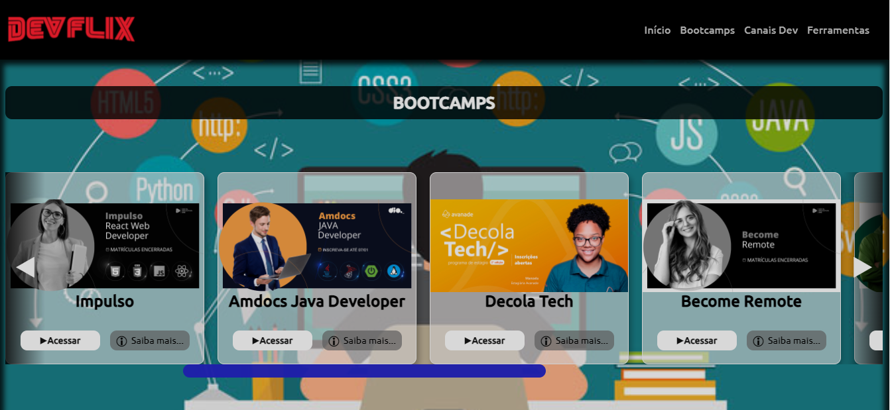

# DEVFLIX
 ## Projeto Desafio Bootcamp front-end Inter - DIO 
 ## Releitura da interface Netflix
 
 # DEVFLIX (Utilizando HTML, CSS e JavaScript puro)

  

[Confira o projeto Funcionando clicando aqui!](https://ikytussistemas.github.io/devflix/) 
